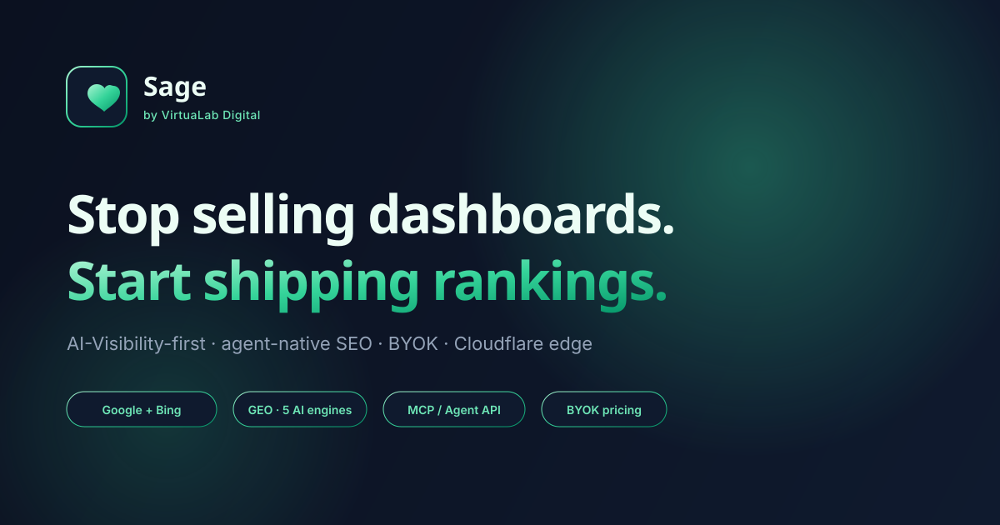

# Sage by VirtuaLab Digital

> The AI-Visibility-first, agent-native SEO platform. Track Google + Bing, dominate AI search (ChatGPT, Perplexity, AI Overviews), generate humanized content, and let AI agents run fixes via MCP.



## What is Sage?

Sage is a complete SEO SaaS platform built for 2026 — when 60%+ of informational queries end on Google without a click because the answer is generated by an AI engine. Legacy tools (Yoast, Ahrefs, Semrush) treat Google as the only search engine. Sage tracks Google + Bing + 5 AI engines, because that's where your customers actually ask questions.

### Key differentiators
- **AI-Visibility-first**: GEO tracking across ChatGPT, Perplexity, Google AI Overviews, SearchGPT, Claude
- **Agent-native**: 28-tool MCP server — Claude Desktop, Cursor, and Cline can run audits, generate content, and ship fixes directly
- **3 specialized content generators**: Home / Services / Blog — each grounded in your Brand Brain, humanized via De-AI, scored on E-E-A-T + SEO + Content Gap
- **BYOK pricing**: Bring your own DataForSEO + LLM keys, pay wholesale data costs (no Ahrefs markup)
- **Edge-native**: Built on Cloudflare Workers + D1

## Architecture

```
┌─────────────────────────────────────────────────────────┐
│  Cloudflare Pages (edge runtime)                         │
│  ├── Marketing site (/)                                  │
│  ├── Dashboard UI (/?view=app)                           │
│  └── MCP Server (/api/mcp) — 28 tools, JSON-RPC 2.0      │
├─────────────────────────────────────────────────────────┤
│  Cloudflare D1 (SQLite at edge)                          │
│  └── 16 Prisma models                                    │
├─────────────────────────────────────────────────────────┤
│  External Integrations (BYOK + fallback)                 │
│  ├── DataForSEO — SERP + keyword data (Google + Bing)    │
│  ├── OpenAI / Anthropic — content generation             │
│  ├── Google APIs — Search Console + GA4                  │
│  └── Stripe — subscription billing + credits             │
└─────────────────────────────────────────────────────────┘
```

## Tech Stack
- **Framework**: Next.js 16 (App Router) + TypeScript 5
- **Styling**: Tailwind CSS 4 + shadcn/ui
- **Database**: Prisma ORM + SQLite (local) / Cloudflare D1 (prod)
- **Auth**: NextAuth.js v4 (JWT strategy, edge-compatible)
- **Billing**: Stripe (subscriptions + credit ledger)
- **State**: TanStack Query (dashboard) + Framer Motion (animations)
- **Charts**: Recharts
- **Deploy**: Cloudflare Pages via `@cloudflare/next-on-pages`

## Quick Start

```bash
# 1. Install dependencies
bun install

# 2. Copy env template + fill in your keys
cp .env.example .env
# → Edit .env with your API keys (see SETUP_API_KEYS.md)

# 3. Set up database
bun run db:push
bun run db:seed

# 4. Start dev server
bun run dev
# → Open http://localhost:3000

# 5. View dashboard
# → http://localhost:3000/?view=app
# → API key for write actions: sage_live_demo_key_0000000000000000
```

## Documentation

| Doc | What it covers |
|---|---|
| [SETUP_API_KEYS.md](./SETUP_API_KEYS.md) | Every API to enable (Google Cloud, Bing, DataForSEO, OpenAI, Stripe) |
| [DEPLOYMENT.md](./DEPLOYMENT.md) | Cloudflare Pages + D1 deployment step-by-step |
| [sage-seo-analysis-report.md](./sage-seo-analysis-report.md) | Original product strategy (analysis of 6 open-source SEO tools) |

## The 28-Tool MCP Server

Sage exposes all capabilities via a Model Context Protocol server at `/api/mcp`. Connect Claude Desktop, Cursor, or any MCP-compatible agent:

```json
{
  "mcpServers": {
    "sage": {
      "url": "https://sage.virtualab.digital/api/mcp",
      "headers": { "Authorization": "Bearer sage_live_..." }
    }
  }
}
```

| Category | Tools | Read/Write |
|---|---|---|
| Site & Core Management | sites.list, sites.create, sites.delete | 1R, 2W |
| Keywords & Rank Tracking | keywords.list, keywords.add, rankings.get, rankings.refresh | 2R, 2W |
| AI Citations (GEO) | citations.get, citations.battlecards, llmstxt.generate | 3R |
| Content Generators | generate.homepage/services/blog, score, humanize, list | 3R, 3W |
| Technical Audits | audits.latest, audits.run, links.internal, schema.generate | 3R, 1W |
| SEO Version Control | changes.list, changes.rollback, changes.record | 1R, 2W |
| Brand Brain | brandbrain.get, brandbrain.update, brandbrain.files.add | 1R, 2W |
| Analytics | analytics.gsc, analytics.decay | 2R |

## Pricing Model (Hybrid BYOK)

| Plan | Price | Credits | Sites | Keywords |
|---|---|---|---|---|
| **Free · BYOK** | $0/mo | $0 | 1 | 100 |
| **Pro** | $49/mo | $30/mo included | 5 | 1,000 |
| **Agency** | $149/mo | $100/mo included | ∞ | 10,000 |

Users can BYOK (DataForSEO + LLM keys) on any tier to bypass credits and pay wholesale data costs direct. No markup — same rates DataForSEO charges.

## Project Structure

```
├── prisma/
│   ├── schema.prisma              # 16 models (User, Site, Keyword, Ranking, etc.)
│   └── migrations/d1_init.sql     # D1-compatible SQL migration
├── scripts/
│   ├── seed.ts                    # Demo data generator
│   ├── deploy-cf.sh               # Cloudflare deploy script
│   └── migrate-d1.sh              # D1 migration script
├── src/
│   ├── app/
│   │   ├── page.tsx               # Marketing + dashboard toggle (?view=app)
│   │   ├── layout.tsx             # Root layout + SEO metadata + JSON-LD
│   │   ├── api/
│   │   │   ├── mcp/               # MCP server (JSON-RPC + REST)
│   │   │   └── stripe/            # Stripe checkout/portal/webhook
│   │   └── globals.css            # Dark premium design system
│   ├── components/
│   │   ├── site/                  # Marketing site components
│   │   └── dashboard/             # Dashboard UI (10 views)
│   └── lib/
│       ├── auth.ts                # NextAuth config + plan definitions
│       ├── billing.ts             # Stripe + credit ledger
│       ├── db.ts                  # Prisma client
│       ├── mcp/                   # MCP server (tools, auth, content pipeline)
│       └── integrations/          # DataForSEO, LLM, Google clients
├── public/                        # favicon, og.svg, manifest, robots.txt
├── wrangler.toml                  # Cloudflare Pages config
├── .env.example                   # Env var template
├── DEPLOYMENT.md                  # Deploy guide
├── SETUP_API_KEYS.md              # API setup guide
└── package.json
```

## License

Proprietary — © VirtuaLab Digital. All rights reserved.
